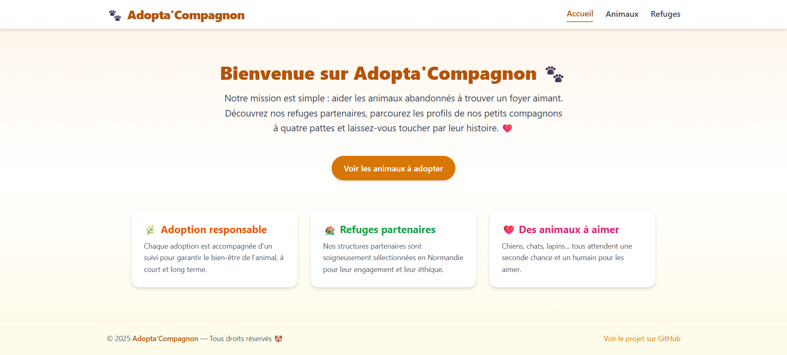
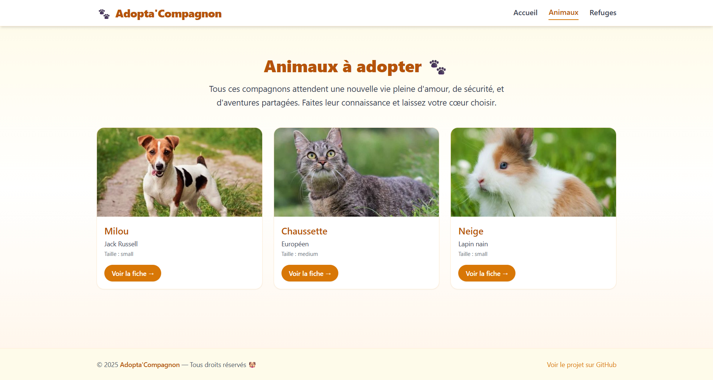
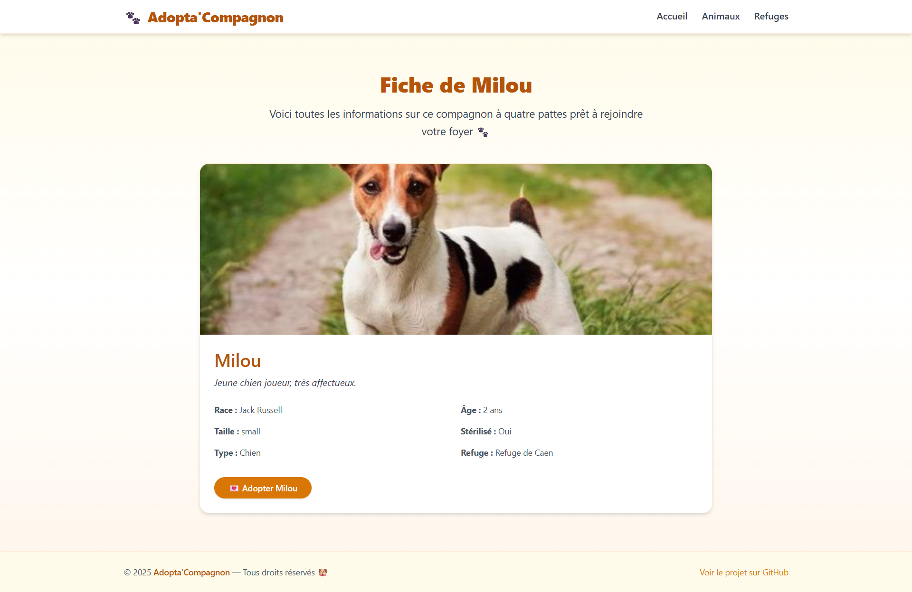
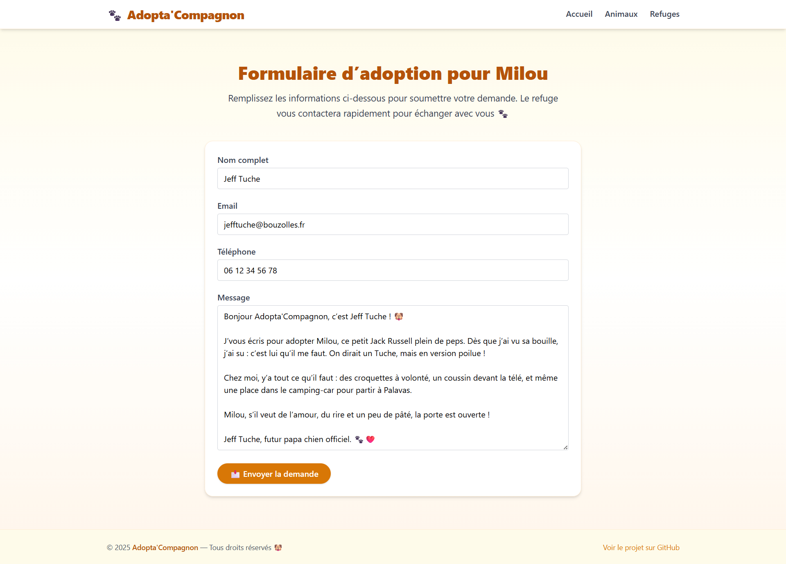
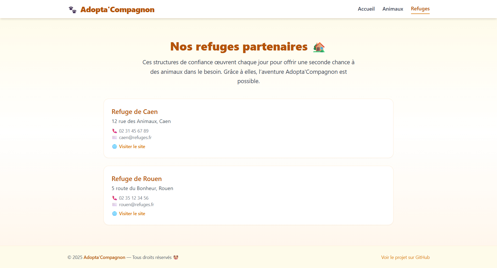

# 🧰 Installation & Test – Adopta'Compagnon sur Windows 11

Ce guide explique **comment installer et tester** l’application Adopta’Compagnon (frontend Vue.js + backend Strapi) sur un ordinateur sous **Windows 11**.

---

## ✅ Pré-requis à installer

Avant de commencer, installez les outils suivants :

### 🔹 Node.js (v18 ou v20 recommandé)
- Télécharger : https://nodejs.org/
- Choisir la version **LTS recommandée**
- Vérifier en ouvrant PowerShell :
```bash
node -v
npm -v
```

### 🔹 Git
- Télécharger : https://git-scm.com/download/win
- Pendant l'installation, cocher **"Add Git to PATH"**
- Vérifier :
```bash
git --version
```

---

## 📁 Cloner les dépôts du projet

1. Ouvrir un terminal (PowerShell)  
2. Créer un dossier de travail :

```bash
cd Desktop
mkdir adopta-project
cd adopta-project
```

3. Cloner les deux dépôts Git :

```bash
git clone https://github.com/Tom-Dln/adopta-backend.git
git clone https://github.com/Tom-Dln/adopta-frontend.git
```

---

## ⚙️ Lancer le backend Strapi

```bash
cd adopta-backend
npm install
npm run develop
```

- L’interface d’administration sera disponible sur : `http://localhost:1337/admin`
- Lors du premier lancement, créer un compte administrateur
- Laisser Strapi tourner pendant l'utilisation du frontend

---

## 💻 Lancer le frontend Vue.js

Ouvrir **un second terminal** :

```bash
cd adopta-frontend
npm install
npm run dev
```

- Le site s’ouvre par défaut à l’adresse : `http://localhost:5173`

---

## ✅ Tester l'application

1. Accéder à la page d’accueil : http://localhost:5173
2. Vérifier :
   - ✔️ Affichage de la liste des animaux
   - ✔️ Accès à la fiche d’un animal
   - ✔️ Envoi d’une demande via le formulaire
   - ✔️ Affichage de la liste des refuges
3. Aller dans l’admin Strapi (`localhost:1337/admin`) pour voir les contenus enregistrés

---

## 📸 Captures d'écrans

1. Accueil (`/`)

2. Liste des animaux (`/animals`)

3. Détail d’un animal (`/animals/:id`)

4. Formulaire rempli (`/adopt/:id`)

5. Liste des refuges (`/shelters`)


---

## 📌 Astuces

- Utilisez deux terminaux ouverts côte à côte pour lancer le front et le back en parallèle.
- Si un port est déjà utilisé, vous pouvez forcer un autre port avec :
```bash
npm run dev -- --port=5174
```

---

## 📝 Auteur

Tom Delaunay | MyDigitalSchool Caen | M2-DFS 2025